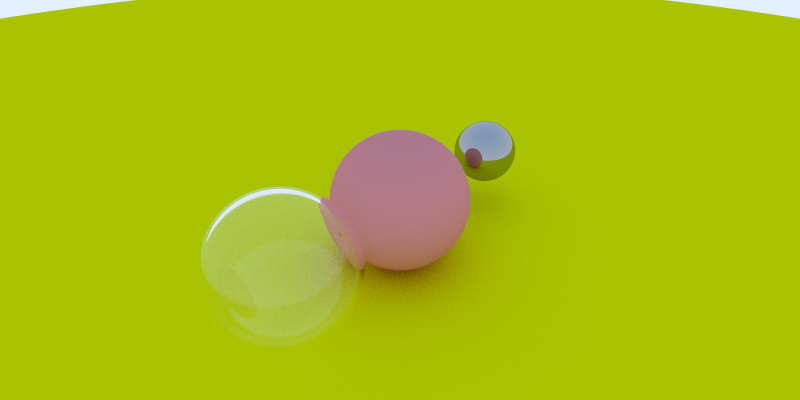
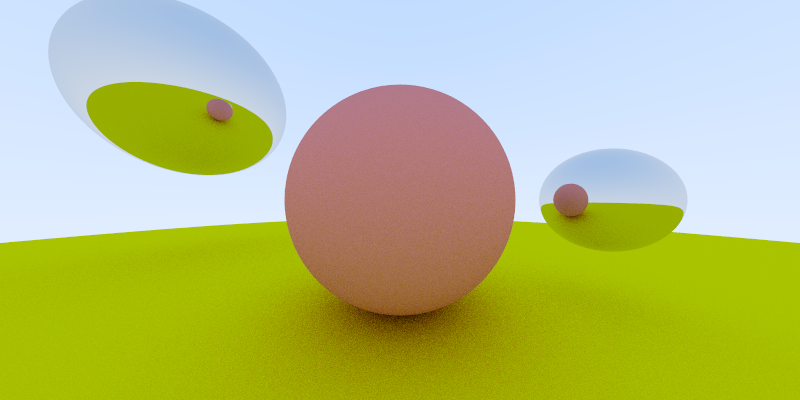
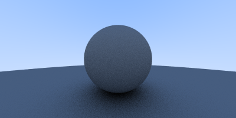

# Introduction

Simple C++ raytracer. Following the excellent "[Raytracer in a weekend](http://www.realtimerendering.com/raytracing/Ray%20Tracing%20in%20a%20Weekend.pdf)", with some changes in the design and a few performance improvements.

# Sample images







# Building

This project uses CMake as its build system. Currently there is one one option:

* ```USE_OMP```: Enables the use of OpenMP for parallel computation. Default is ON

To make an out of source build simply execute the following from the projet's root directory:

```shell
mkdir -p build
cd build
cmake .. -DCMAKE_BUILD_TYPE=RelWithDebInfo -DUSE_OMP=ON
make
```

And now you can execute the demo program:

```
bin/raytracer
```

Which will produce two images.